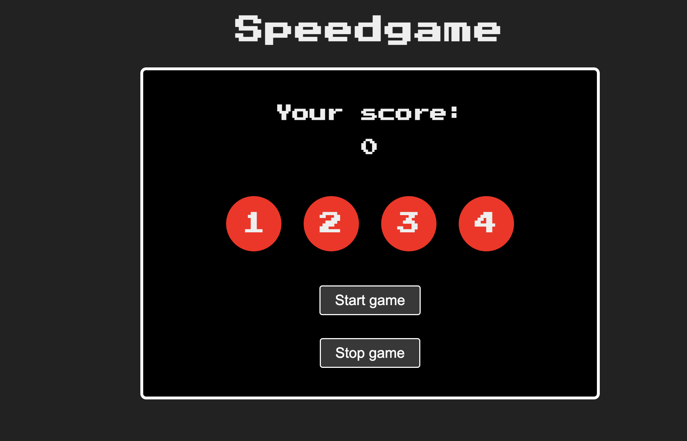

# Speedgame:

The Circle Game is a simple game built using HTML, CSS, and JavaScript. The objective of the game is to click on the circle that is highlighted in a random sequence, without clicking on the wrong circle. The game keeps track of your score and ends after a certain number of rounds.

# Features

The code defines several constants and variables, such as the circles, score, speed, and timer, and creates two sound objects for the start and stop of the game.

It has several functions, such as sound, startMusic, stopMusic, rightClick, startGame, stopGame, and closeGame.

The startGame function starts the game by highlighting a random circle and toggling it as active. It also sets a timer that updates the circle highlighting speed and renders the next active circle. The game stops when the user clicks on a wrong circle, or when three rounds are completed.

The stopGame function stops the game and displays the user's score in a modal, and the closeGame function reloads the window to restart the game

# How to Play

- Click on the "Start" button to begin the game
- The game will highlight a random circle, which you must click on before the time runs out.
- After each successful click, the game will highlight another random circle.
- If you click on the wrong circle, the game will end and your score will be displayed.
- You can click on the "Stop" button at any time to end the game.
- The game ends after a certain number of rounds, and your score will be displayed in a modal window.

## Tech Stack Used

- HTML
- JS
- CSS

## Screenshot

## Setup and usage

Game is up and running [here](https://public.bc.fi/s2300110/speed_game/)

## Lerning Outcome from this project

- Understading DOM
- Understading game logic building

## Author

[Monsur Saleh](https://www.github.com/monsursaleh)
